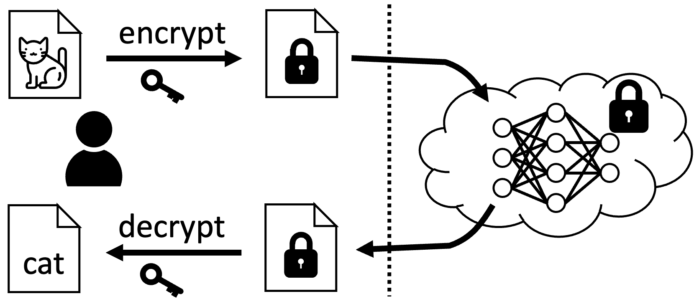
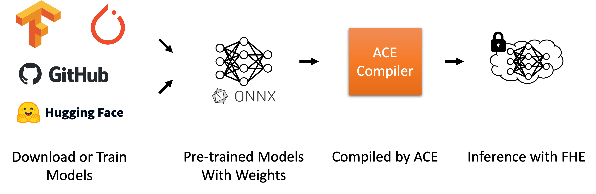
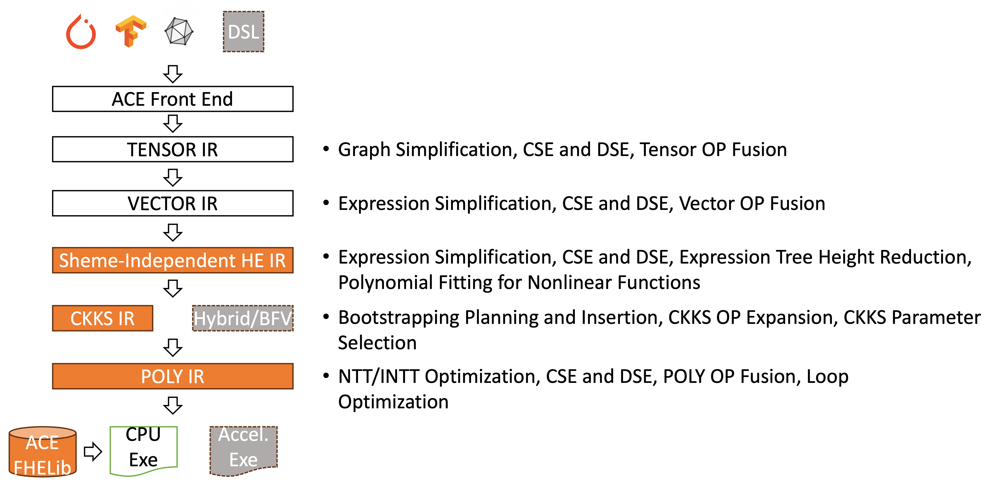

    

        <h1>Computing Systems Lab</h1>
        
Privacy Computing Accelerators and AI Distributed Systems

        
<a class="btn btn-primary btn-lg" href="https://www.antresearch.com/LaboratoryDetails/Computing-Systems-Laboratory-detail" role="button">Offical Website</a>

    

<b>ANT-ACE</b> is a Fully Homomorphic Encryption (FHE) Compiler Framework designed for automating Neural Network (NN) Inference. ANT-ACE accepts a pre-trained ONNX model as input and directly generates C/C++ programs to perform NN inference on encrypted data.

FHE represents a revolutionary cryptographic technology that enables direct computations on encrypted data without the need for decryption. This powerful technique allows for the manipulation of sensitive data while ensuring that the computing party remains unaware of the actual information, yet still produces valuable encrypted output.

<i>Decrypt(Homo_Add(Encrypt(a), Encrypt(b))) == Add(a, b)</i>

<i>Decrypt(Homo_Mult(Encrypt(a), Encrypt(b))) == Mult(a, b)</i>

ANT-ACE is tailored for Privacy-Preserving Machine Learning (PPML) Inference Applications. In this setup, ML inference operates in the cloud, enabling clients to upload their data and receive inference results. Typically, ML inference services transfer both data and results in plaintext, risking exposure to privacy breaches. Although traditional symmetric encryption secures data during transmission, it does not prevent privacy leaks within the cloud infrastructure. There is a risk that service providers might access the data, either inadvertently or with malicious intent. However, using homomorphic encryption allows ML inference to be performed directly on encrypted user data. This method ensures that sensitive user data is shielded from unauthorized access at all stages of the cloud-based inference process.

ANT-ACE takes a pre-trained ML model as input and compiles it into an FHE program directly for both the server side and client side. This makes ANT-ACE easily integrable into any existing ML framework, such as ONNX, PyTorch, TensorFlow, and others. In this way, the development of FHE applications is greatly simplified. As a result, developers won't need to understand the sophisticated mathematical foundations behind FHE, grasp the intricacies of effectively using FHE libraries, or manually manage trade-offs between correctness, security, and performance involving security parameter selection and complex optimizations regarding homomorphic operations such as noise and scale management. This significantly simplifies the development process for FHE applications.

Currently, ANT-ACE is designed with a compiler infrastructure that supports five levels of abstraction (i.e., five IRs) to compile pre-trained ML models operating on multi-dimensional tensors into low-level polynomial operations. These five phases successively translate pre-trained models into C/C++ programs by automatically performing various analyses and optimizations to make trade-offs between correctness, security, and performance.

The ANT-ACE compiler framework marks an initial step in our FHE compiler technology research. We have developed fundamental capabilities for an FHE compiler focused on privacy-preserving machine learning inference, showcased through multiple abstraction levels that automate ONNX model inference using CKKS-encrypted data on CPUs. Future extensions of ANT-ACE will support various input formats and FHE schemes across different computing architectures, including GPUs, enhanced by contributions from open-source communities.

